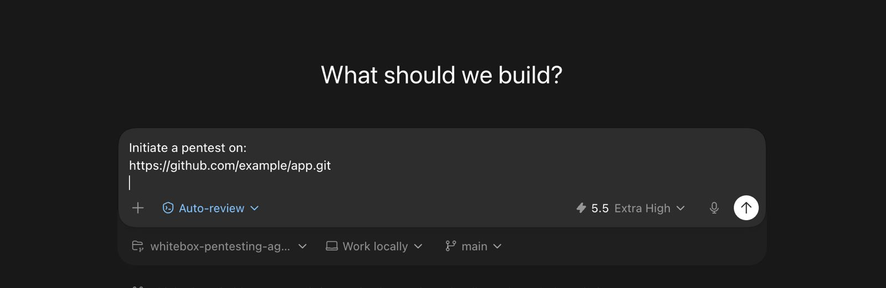

<p align="center">
  
</p>

<h1 align="center">Hadrian OpenHack</h1>

<p align="center"><em>A lightweight, file-based workspace for source-guided whitebox security review.</em></p>

[](LICENSE)
[](https://www.python.org/)

`openhack` is a set of agents and tools that mimics how the
Hadrian research team performs automated vulnerability research. The methodology
has been adjusted so it can run inside a common model harness — Claude Code,
Codex, Cursor, or a custom runner — while keeping durable state in plain files:
cloned source, recon items, scenario prompts, scenario results, finding
candidates, triage decisions, findings, and logs. The harness provides model
execution, terminal access, repository access, and human-in-the-loop approval;
this tool provides the durable workflow and review artifacts.

**The core idea:** checkpointed, scenario-first review. Recon discovers surfaces,
a router agent turns them into scoped scenarios, expert agents prove or reject
each scenario, and an independent triage agent decides which verified candidates
become final findings. The human approves every phase transition.

---

<p align="center">
  
</p>

## Quick Start

The easiest way to get started is to open this repository in a coding harness
such as Codex, Claude Code, or Cursor and ask it:

```text
Initiate a whitebox pentest on https://github.com/example/app.git
```

The harness should follow `AGENTS.md`: initialize a run, summarize each
checkpoint, and ask before moving to the next phase.

**Manual CLI flow:** install the CLI from the repository root:

```bash
python3 -m pip install -e .
```

This project is currently distributed as a workspace-first repository. The
root-level `agents/`, `config/`, `templates/`, and writable `runs/` directories
are runtime data, so the supported install model is a cloned checkout with an
editable install. If you invoke `openhack` from outside the checkout, set
`OPENHACK_ROOT` to the repository root.

**2. Walk through a run.** Execute one command at a time. Each command prints a
checkpoint summary and the next command to run — review the output and approve
before continuing.

```bash
# Create a run from a fresh git checkout
openhack init-run demo https://github.com/example/app.git --run-id demo-001

# Choose expert scope, then run reconnaissance
openhack run-recon demo demo-001 --all-agents

# Or scope the run to selected experts
openhack run-recon demo demo-001 \
  --expert injection \
  --expert broken-access-control

# Optional: enrich recon with bundled Semgrep rules
openhack run-recon demo demo-001 --all-agents --semgrep

# Generate the scenario backlog from routing units in one approved routing phase
openhack create-scenarios demo demo-001

# After the router answers the prompt, record the selected backlog
openhack record-scenario-backlog demo demo-001 router-result.json

# Render a scenario prompt for an expert agent
openhack render-scenario-prompt demo demo-001 S001

# Record an expert's verified result (materializes finding-candidates/)
openhack record-scenario-result demo demo-001 S001 result.json

# Render and record independent triage before final findings are created
openhack render-finding-triage-prompt demo demo-001 S001-F001
openhack record-finding-triage demo demo-001 S001-F001 triage-result.json

# Resume or hand off: prints current counts + next checkpoint
openhack summarize-run demo demo-001
```

> **Resuming a run?** Run `openhack summarize-run <target> <run-id>` to see counts
> and the next checkpoint command without executing anything.

Set `OPENHACK_ROOT` to this workspace path if you invoke the CLI from
outside the repo root. See [`docs/QUICKSTART.md`](docs/QUICKSTART.md) for more
detail.

---

## How It Works

Hadrian is a state machine around files. A command advances the run to the next
durable state, an agent answers the exact prompt for that state, and the next
recorder command validates the answer before materializing new work. Humans
approve phase transitions; the long-running parts are still item-by-item loops,
not bulk analysis.

The durable chain stays narrow on purpose:

```text
recon item  →  routing unit  →  scenario  →  scenario result  →  finding candidate  →  triage decision  →  finding
```

The workflow widens only where evidence requires it: one routing unit may fan
out to several experts, one scenario may emit several finding candidates, and
each candidate then gets its own independent triage decision.

```mermaid
%%{init: {
  'theme': 'base',
  'themeVariables': {
    'background': '#0a0a0a',
    'fontFamily': '"Inter", "IBM Plex Sans", system-ui',
    'primaryColor': '#1a1a1a',
    'primaryBorderColor': '#2e2e2e',
    'primaryTextColor': '#e8e8e8',
    'lineColor': '#4a4a4a',
    'edgeLabelBackground': 'transparent',
    'clusterBkg': '#0a0a0a',
    'clusterBorder': '#2e2e2e',
    'tertiaryColor': '#0a0a0a'
  },
  'flowchart': {
    'htmlLabels': true,
    'nodeSpacing': 50,
    'rankSpacing': 70,
    'curve': 'basis'
  },
  'themeCSS': 'svg { background: #0a0a0a !important; } .flowchart { background: #0a0a0a !important; } .node rect, .node polygon { rx: 6px; ry: 6px; } .nodeLabel { font-family: "Inter", "IBM Plex Sans", system-ui !important; line-height: 1.2; } .node-title { color: #e8e8e8; font-size: 14px; font-weight: 500; } .node-subtitle { color: #a0a0a0; font-size: 12px; font-weight: 400; } .gate .node-title, .gate .node-subtitle, .agent .node-title, .agent .node-subtitle { color: #ffffff; } .flowchart-link { stroke: #4a4a4a !important; stroke-width: 1px !important; } marker path { fill: #4a4a4a !important; stroke: #4a4a4a !important; transform: scale(.72); transform-origin: center; } .edgeLabel, .edgeLabel p, .edgeLabel span, .edgeLabel div { background: transparent !important; color: #888888 !important; fill: #888888 !important; font-family: "Inter", "IBM Plex Sans", system-ui !important; font-size: 11px !important; font-style: italic !important; font-weight: 400 !important; } .edgeLabel rect, .labelBkg { opacity: 0 !important; fill: transparent !important; background: transparent !important; }'
}}%%
flowchart TD
  classDef gate fill:#FF003D,stroke:#FF003D,stroke-width:1.5px,color:#ffffff;
  classDef command fill:#1a1a1a,stroke:#2e2e2e,stroke-width:1px,color:#e8e8e8;
  classDef agent fill:#161616,stroke:#FF003D,stroke-width:1.5px,color:#ffffff;
  classDef artifact fill:#1a1a1a,stroke:#2e2e2e,stroke-width:1px,color:#e8e8e8;
  classDef loop fill:#1a1a1a,stroke:#2e2e2e,stroke-width:1px,color:#e8e8e8;
  classDef final fill:#1a1a1a,stroke:#2e2e2e,stroke-width:1px,color:#e8e8e8;

  start["<span class='node-title'>Operator request</span>"]:::gate
  init["<span class='node-title'>init-run</span><br/><span class='node-subtitle'>snapshot target and run metadata</span>"]:::command
  scope["<span class='node-title'>Expert scope approved</span><br/><span class='node-subtitle'>all agents or selected experts</span>"]:::gate
  recon["<span class='node-title'>run-recon</span><br/><span class='node-subtitle'>routes, inputs, sinks, boundaries, exposures</span>"]:::agent
  enrich["<span class='node-title'>Optional Semgrep enrichment</span><br/><span class='node-subtitle'>source-pattern hints</span>"]:::command
  units["<span class='node-title'>routing-units.jsonl</span><br/><span class='node-subtitle'>clustered review surfaces</span>"]:::artifact
  routerPrompt["<span class='node-title'>create-scenarios</span><br/><span class='node-subtitle'>router prompt, no extra gate</span>"]:::command
  router["<span class='node-title'>Scenario-router answer</span><br/><span class='node-subtitle'>scenarios + coverage decisions</span>"]:::agent
  backlog["<span class='node-title'>record-scenario-backlog</span><br/><span class='node-subtitle'>validated scenario queue</span>"]:::artifact
  scenarioLoop["<span class='node-title'>Scenario loop</span><br/><span class='node-subtitle'>render S### prompt → expert subagent → record result</span>"]:::agent
  candidates["<span class='node-title'>finding-candidates/</span><br/><span class='node-subtitle'>pending_triage</span>"]:::artifact
  triageLoop["<span class='node-title'>Finding triage loop</span><br/><span class='node-subtitle'>render S###-F### prompt → triage subagent → record decision</span>"]:::agent
  findings["<span class='node-title'>findings/*.md</span><br/><span class='node-subtitle'>accepted or downgraded only</span>"]:::final
  validate["<span class='node-title'>validate-run</span><br/><span class='node-subtitle'>schema, coverage, and integrity checks</span>"]:::command
  resume["<span class='node-title'>summarize-run</span><br/><span class='node-subtitle'>counts + next checkpoint</span>"]:::command

  start --> init --> scope --> recon --> units --> routerPrompt --> router --> backlog
  recon -. rerun with Semgrep .-> enrich
  enrich -. normalized into recon output .-> units
  backlog --> scenarioLoop
  scenarioLoop -->|verified with findings| candidates
  scenarioLoop -->|rejected, candidate, or needs_context| resume
  candidates --> triageLoop
  triageLoop -->|accepted or downgraded| findings --> validate
  triageLoop -->|duplicate, rejected, or needs_context| validate
  validate -->|handoff or fix-forward| resume
  linkStyle default stroke:#4a4a4a,stroke-width:1px;
```



### Output States

| State | Primary outputs | What it means |
|---|---|---|
| **Initialized** | `run-config.yaml`, `sourcecode/`, `run-state.jsonl` | The target is pinned to a source checkout, commit, branch, and run id. |
| **Recon complete** | `recon-output/recon-items.jsonl`, inventories, `routing-units.jsonl` | The workspace has mapped review surfaces, but no vulnerability has been proven. |
| **Router prompt ready** | `scenarios/scenario-router-prompt.md` | A scenario-router agent has a compact, evidence-based prompt; it has not created durable scenarios yet. |
| **Backlog recorded** | `scenarios/index.jsonl`, `scenarios/backlog/S###.json`, `S###.md`, `coverage-decisions.json` | The router output passed coverage validation and became the review queue. |
| **Scenario loop in progress** | `scenarios/finished/S###.json` | Each finished scenario has its own prompt hash, subagent id, reviewed files, status, and evidence. |
| **Candidate triage pending** | `finding-candidates/S###-F###.json` | A scenario expert proposed a verified issue; it is still not a final finding. |
| **Triage loop in progress** | `finding-triage/prompts/`, `finding-triage/decisions/` | Each candidate receives an independent reportability, dedupe, confidence, and severity review. |
| **Findings materialized** | `findings/*.md` | Only accepted or downgraded triage decisions write final finding reports. |
| **Validated** | command output from `validate-run` | Schemas, prompt hashes, coverage gates, candidate/triage consistency, and final finding materialization have been checked. |

### Loops and Gates

**Human gates are phase gates.** The operator approves expert scope before recon,
scenario routing after recon, the scenario backlog after the router answer, and
the finding-triage backlog after candidate creation. Approving a backlog means
"process every unfinished item," not "summarize the batch."

**Scenario review is a queue.** Every `S###` is rendered as a standalone prompt,
assigned to exactly one expert subagent, reviewed against source, and recorded
with `review_mode: "per-scenario-subagent"`. Status can be `verified`,
`candidate`, `rejected`, or `needs_context`; only `verified` results may emit
finding candidates.

**Finding triage is a second queue.** Every `S###-F###` candidate gets a
standalone triage prompt and a separate triage subagent. Decisions can be
`accepted`, `downgraded`, `duplicate`, `rejected`, or `needs_context`; only
`accepted` and `downgraded` materialize Markdown findings.

**Resume is always derived from files.** `summarize-run` reads the run directory
and reports counts plus the next missing durable phase, so interrupted work can
continue without reconstructing model context.

All workflow commands append audit records to `logs/events.jsonl` and
`trace.jsonl`. Those logs record what happened, the artifacts involved, and the
handoff status; final findings still come only through the recorded scenario and
triage chain above.

---

## Core Concepts

| Artifact | What it is |
|---|---|
| **Recon item** | A discovered place worth review — a route, sink, auth boundary, manifest, upload handler, or parser entrypoint. |
| **Routing unit** | A deterministic cluster around an endpoint, handler, parameter, upload/download path, SQL/HTML/redirect sink, parser, auth flow, static exposure, or dependency surface. |
| **Scenario** | One routing unit + one expert + one proof question. The same unit or file may appear in multiple scenarios when multiple root-cause experts are relevant. |
| **Scenario result** | A recorded expert answer for one scenario: verified, rejected, or needs more context. |
| **Finding candidate** | A scenario expert's proposed verified vulnerability, pending independent triage. |
| **Triage decision** | An independent one-candidate admission decision that checks reportability, scope, confidence, and severity. |
| **Finding** | A triage-accepted vulnerability. One scenario can produce multiple candidates when separate parameters, sinks, or trust boundaries are independently vulnerable. |

**Expert scope** is chosen before recon. Use `all agents` for broad coverage, or
select one or more expert IDs to focus routing. The chosen scope is written to
`run-config.yaml`, and later coverage, router prompts, and backlog recording are
constrained to that same set of experts. After recon, one approval covers
creating the router prompt, getting the router answer, and recording the
scenario backlog; the prompt render is not a separate checkpoint.

**Findings are accepted only when recorded through `scenarios/finished/`,
`finding-candidates/`, `finding-triage/decisions/`, and `findings/`.** Do not
start a pentest with a broad LLM source sweep — the contract is command-first
and artifact-first.

Logs are audit artifacts, not private reasoning transcripts: what was done, what
evidence was used, what decision was made, status, and handoffs.

---

## Command Reference

Run commands from the repository root (or set `OPENHACK_ROOT`).

| Command | Purpose |
|---|---|
| `openhack init-run <target> <git-url> [--run-id <id>] [--branch <branch>]` | Clone the target into a fresh run workspace. |
| `openhack run-recon <target> <run-id> --all-agents [--semgrep]` | Source reconnaissance with every configured security expert; `--semgrep` adds bundled rule hints. |
| `openhack run-recon <target> <run-id> --expert <id> [--expert <id> ...] [--semgrep]` | Source reconnaissance scoped to selected expert IDs. |
| `openhack create-scenarios <target> <run-id>` | Build the scenario-router agent prompt from routing units and compact recon output. |
| `openhack record-scenario-backlog <target> <run-id> <router-result.json>` | Materialize the router's selected backlog into `scenarios/backlog/`. |
| `openhack render-scenario-prompt <target> <run-id> <S###>` | Render a scenario prompt for an expert agent. |
| `openhack record-scenario-result <target> <run-id> <S###> <result.json>` | Record an expert result and materialize any finding candidates. |
| `openhack record-scenario-result <target> <run-id> <bundle.json>` | Record a multi-scenario bundle (top-level `results` array). |
| `openhack render-finding-triage-prompt <target> <run-id> <S###-F###>` | Render a prompt for the independent finding-triage agent. |
| `openhack record-finding-triage <target> <run-id> <S###-F###> <triage-result.json>` | Record reportability, dedupe, confidence, and severity due diligence; accepted/downgraded decisions materialize final findings. |
| `openhack summarize-run <target> <run-id>` | Print current counts and the next checkpoint command. |
| `openhack log-event <target> <run-id> <actor> <status> <summary>` | Append an operational log event. |
| `openhack validate-run [<target> <run-id>]` | Validate the whole repo or a specific run. |

### What recon produces

`run-recon` writes `recon-items.jsonl` plus lightweight `routes.jsonl`,
`inputs.jsonl`, `sinks.jsonl`, `exposures.jsonl`, `request-boundaries.jsonl`,
`coverage-gaps.json`, and `routing-units.jsonl`. Routing units cluster noisy
line hits into review surfaces before the LLM router sees them. With
`--semgrep`, raw `semgrep-results.json` is also written and normalized into the
same recon items, routing units, and routing requirements.
**Semgrep hits are hints, not verified vulnerabilities.** Recon also records
expert scope in `run-config.yaml`; rerun with `--all-agents` or repeated
`--expert` options to change scope before scenario routing.

### What the router does

`create-scenarios` does not create final scenarios itself. It writes
`runs/<target>/<run-id>/scenarios/scenario-router-prompt.md`, which the
scenario-router agent answers with JSON containing top-level `scenarios` and
`coverage_decisions` arrays. The prompt prioritizes `routing-units.jsonl` and
uses compact inventory and Semgrep summaries instead of the full raw
inventory dump. `record-scenario-backlog` validates that every mandatory
`routing_unit_id + expert`, recon path, and path/expert requirement is either
represented by a scenario or explicitly explained by a coverage decision before
materializing the backlog.
The router prompt is an intermediate artifact inside the approved routing phase;
pause for human review after the backlog is materialized, not between prompt
creation and router answer.
The prompt and validator only use experts selected before recon, so a focused
run does not create backlog work for unselected experts.

### What finding triage does

Scenario experts write proposed vulnerabilities into the scenario result's
`findings` array, but `record-scenario-result` stores them as
`finding-candidates/S###-F###.json`. A candidate is not a final report.

For each candidate, render a dedicated prompt for the `finding-triage` agent.
That agent independently checks evidence quality, reportability, duplicate or
merge scope, confidence, and severity due diligence. `record-finding-triage`
records the decision under `finding-triage/decisions/`; only `accepted` and
`downgraded` decisions create Markdown reports under `findings/`.

---

## Run Layout

Every run lives under `runs/<target>/<run-id>/`:

```text
runs/<target>/<run-id>/
  sourcecode/           Fresh git checkout for this run.
  recon-output/         Recon items, inventories, routing units, coverage gaps.
  scenarios/
    backlog/            Scenario JSON and rendered expert prompts.
    finished/           Recorded scenario results.
  finding-candidates/   Proposed findings emitted by scenario experts.
  finding-triage/
    prompts/            Rendered one-candidate triage prompts.
    decisions/          Recorded triage decisions.
  findings/             Triage-accepted findings for this run.
  logs/                 Structured event log.
  run-config.yaml       Target URL, commit, branch, expert scope, workflow metadata.
  run-state.jsonl       Run lifecycle events.
  trace.jsonl           Structured agent and command trace.
```

`runs/**`, `sourcecode/`, nested `sourcecode/`, and `targets/` are gitignored so
target code and review artifacts never get committed.

---

## Repository Structure

```text
config/                            Registry, defaults, and schema contracts.
agents/
  orchestration/                   Run lifecycle, scenario routing, finding triage.
  reconnaissance/                  Source recon agents that emit recon items.
  experts/                         OWASP/MITRE-aligned root-cause family experts.
  shared/                          Protocol all agents follow.
src/openhack/     Shared implementation and editable-install CLI.
templates/                         Scenario, result, finding, and triage templates.
docs/                              Operating model and quickstart notes.
runs/                              Generated run workspaces (gitignored).
```

---

## Agent Model

Agents are Markdown manifests — intentionally compact, but each expert must be
operational. It states when it should receive a scenario, what evidence proves or
rejects the root-cause family, common false positives, and where to handoff
cross-family leads.

The workflow roles:

- **Orchestration agents** own run lifecycle, scenario routing, and finding triage.
- **Reconnaissance agents** find surfaces — routes, files, sinks, auth boundaries,
  upload paths, parser entrypoints, manifests, and debug/admin areas.
- **Expert agents** own OWASP/MITRE-aligned root-cause families. The current
  registry defines **12 expert families** as Markdown manifests in
  `agents/experts/`; each file's YAML frontmatter declares the expert id,
  category, ownership, standards, and routing signals.

The expert families are:

| Expert ID | Standard-aligned title |
|---|---|
| `broken-access-control` | A01:2025 - Broken Access Control |
| `security-misconfiguration` | A02:2025 - Security Misconfiguration |
| `software-supply-chain-failures` | A03:2025 - Software Supply Chain Failures |
| `cryptographic-failures` | A04:2025 - Cryptographic Failures |
| `injection` | A05:2025 - Injection |
| `memory-buffer-boundary-errors` | CWE-119 - Improper Restriction of Operations within the Bounds of a Memory Buffer |
| `insecure-design` | A06:2025 - Insecure Design |
| `authentication-failures` | A07:2025 - Authentication Failures |
| `software-data-integrity-failures` | A08:2025 - Software or Data Integrity Failures |
| `sensitive-information-exposure` | CWE-200 - Exposure of Sensitive Information to an Unauthorized Actor |
| `path-traversal-unrestricted-upload` | CWE-22 / CWE-434 - Path Traversal and Unrestricted Upload |
| `unrestricted-resource-consumption` | API4:2023 / CWE-770 - Unrestricted Resource Consumption |

> **Surfaces are not expert ownership labels.** API, GraphQL, upload, parser,
> admin, and native boundaries are recon signals that fan out to multiple
> experts. Impacts like RCE or account takeover are finding impacts. A verified
> finding must name one primary root-cause owner.
>
> SSRF is covered inside `broken-access-control` because OWASP Top 10:2025 maps
> CWE-918 to A01:2025; the dedicated outbound-client checklist is preserved in
> that expert rather than kept as a separate family.

---

## Development

Validate the workspace or a specific run:

```bash
openhack validate-run
openhack validate-run <target> <run-id>
```

See [`AGENTS.md`](AGENTS.md), [`CONTRIBUTING.md`](CONTRIBUTING.md), and
[`docs/OPERATING_MODEL.md`](docs/OPERATING_MODEL.md) for deeper documentation.

---

## Disclaimer

A note before you use this: this project is an experimental research prototype, provided as-is and without warranty of any kind. It is not a security product, has not been independently audited, and is not intended to be relied upon for any decision involving the security, safety, or correctness of software. It will miss real vulnerabilities and may report issues that do not exist. It is not a substitute for a professional security audit, manual code review, or established static analysis tools, and should never be used as a sole or primary means of assessing risk. By using it, you accept full responsibility for any outcomes, and the authors disclaim all liability for any damages, losses, or consequences arising from its use.

## License

MIT. See [`LICENSE`](LICENSE).
